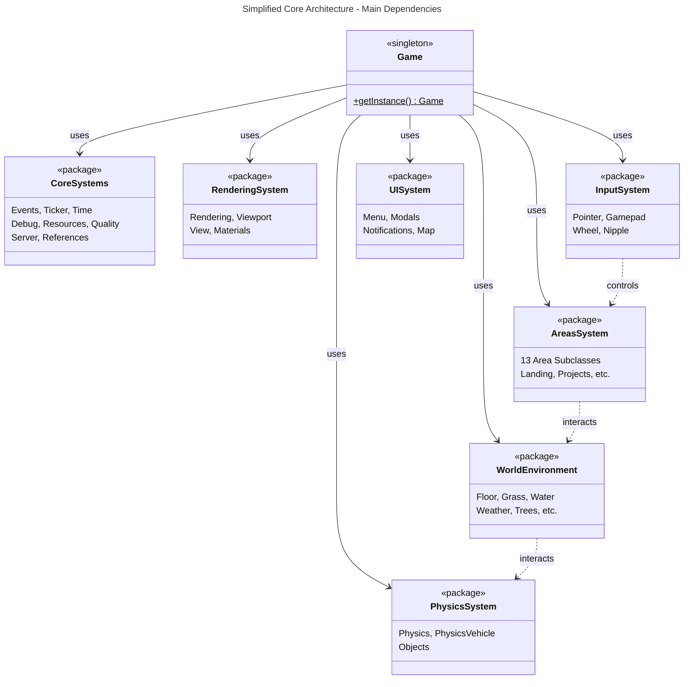
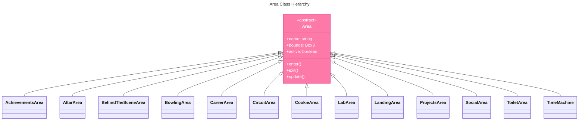

# Three.js WebGPU Game - Class Diagram

## Complete Architecture

```mermaid
---
title: Three.js WebGPU Game - Complete Class Architecture
---
classDiagram
    %% ========================================
    %% CORE SINGLETON & SYSTEMS
    %% ========================================
    class Game {
        <<singleton>>
        -instance: Game
        +getInstance() Game$
        +events: Events
        +ticker: Ticker
        +time: Time
        +debug: Debug
        +resources: ResourcesLoader
        +quality: Quality
        +server: Server
        +references: References
        +rendering: Rendering
        +materials: Materials
        +physics: Physics
        +inputs: Inputs
        +player: Player
        +world: World
        +areas: Areas
        +menu: Menu
        +audio: Audio
        +init()
        +destroy()
    }

    class Events {
        +on(event, callback)
        +off(event, callback)
        +emit(event, data)
    }

    class Ticker {
        +register(callback)
        +unregister(callback)
        +tick()
    }

    class Time {
        +delta: number
        +elapsed: number
        +update()
    }

    class Debug {
        +active: boolean
        +panel: GUI
        +addFolder(name)
    }

    class ResourcesLoader {
        +items: Map
        +load(resources)
        +get(name)
    }

    class Quality {
        +level: string
        +pixelRatio: number
        +setLevel(level)
    }

    class Server {
        +socket: WebSocket
        +connected: boolean
        +connect()
        +send(data)
        +on(event, callback)
    }

    class References {
        +items: Map
        +add(name, reference)
        +get(name)
    }

    %% Game composition relationships
    Game *-- Events : contains
    Game *-- Ticker : contains
    Game *-- Time : contains
    Game *-- Debug : contains
    Game *-- ResourcesLoader : contains
    Game *-- Quality : contains
    Game *-- Server : contains
    Game *-- References : contains

    %% ========================================
    %% RENDERING SYSTEM
    %% ========================================
    class Rendering {
        +renderer: THREE.WebGPURenderer
        +viewport: Viewport
        +view: View
        +preRenderer: PreRenderer
        +fog: Fog
        +init()
        +render()
    }

    class Viewport {
        +width: number
        +height: number
        +aspectRatio: number
        +resize()
    }

    class View {
        +camera: THREE.PerspectiveCamera
        +scene: THREE.Scene
        +update()
    }

    class PreRenderer {
        +renderTargets: Map
        +render()
    }

    class Fog {
        +fog: THREE.Fog
        +update()
    }

    Game *-- Rendering : contains
    Rendering *-- Viewport : contains
    Rendering *-- View : contains
    Rendering *-- PreRenderer : contains
    Rendering *-- Fog : contains

    %% ========================================
    %% MATERIALS SYSTEM
    %% ========================================
    class Materials {
        +meshDefaultMaterial: MeshDefaultMaterial
        +init()
    }

    class MeshDefaultMaterial {
        +color: THREE.Color
        +update()
    }

    class THREE_MeshLambertNodeMaterial {
        <<THREE.js>>
    }

    MeshDefaultMaterial --|> THREE_MeshLambertNodeMaterial : extends

    Game *-- Materials : contains
    Materials *-- MeshDefaultMaterial : contains

    %% ========================================
    %% PHYSICS SYSTEM
    %% ========================================
    class Physics {
        +world: RAPIER.World
        +vehicle: PhysicsVehicle
        +wireframe: PhysicsWireframe
        +objects: Objects
        +update()
        +addRigidBody(body)
    }

    class PhysicsVehicle {
        +chassis: RAPIER.RigidBody
        +wheels: Array
        +update()
    }

    class PhysicsWireframe {
        +mesh: THREE.LineSegments
        +update()
    }

    class Objects {
        +items: Array
        +add(object)
        +remove(object)
    }

    Game *-- Physics : contains
    Physics *-- PhysicsVehicle : contains
    Physics *-- PhysicsWireframe : contains
    Physics *-- Objects : contains

    %% ========================================
    %% INPUT SYSTEM (Composition)
    %% ========================================
    class Inputs {
        +pointer: Pointer
        +gamepad: Gamepad
        +wheel: Wheel
        +interactiveButtons: InteractiveButtons
        +nipple: Nipple
        +update()
    }

    class Pointer {
        +x: number
        +y: number
        +onClick(callback)
    }

    class Gamepad {
        +connected: boolean
        +axes: Array
        +buttons: Array
        +update()
    }

    class Wheel {
        +delta: number
        +onWheel(callback)
    }

    class InteractiveButtons {
        +buttons: Map
        +addButton(name, element)
    }

    class Nipple {
        +manager: NippleJS
        +active: boolean
        +direction: Vector2
    }

    Game *-- Inputs : contains
    Inputs *-- Pointer : contains
    Inputs *-- Gamepad : contains
    Inputs *-- Wheel : contains
    Inputs *-- InteractiveButtons : contains
    Inputs *-- Nipple : contains

    %% ========================================
    %% PLAYER & VEHICLE
    %% ========================================
    class Player {
        +position: THREE.Vector3
        +vehicle: VisualVehicle
        +controls: Object
        +update()
        +respawn()
    }

    class VisualVehicle {
        +mesh: THREE.Group
        +wheels: Array
        +update()
    }

    Game *-- Player : contains
    Player *-- VisualVehicle : contains

    %% ========================================
    %% CYCLES (Inheritance)
    %% ========================================
    class Cycles {
        <<abstract>>
        +progress: number
        +update()
        +setProgress(value)
    }

    class DayCycles {
        +sunPosition: THREE.Vector3
        +ambientIntensity: number
        +update()
    }

    class YearCycles {
        +season: string
        +temperature: number
        +update()
    }

    DayCycles --|> Cycles : extends
    YearCycles --|> Cycles : extends

    %% ========================================
    %% WORLD & ENVIRONMENT
    %% ========================================
    class World {
        +floor: Floor
        +grid: Grid
        +grass: Grass
        +waterSurface: WaterSurface
        +windLines: WindLines
        +leaves: Leaves
        +lightnings: Lightnings
        +snow: Snow
        +rainLines: RainLines
        +confetti: Confetti
        +fireballs: Fireballs
        +tornado: VisualTornado
        +whispers: Whispers
        +flowers: Flowers
        +scenery: Scenery
        +poleLights: PoleLights
        +trees: Trees
        +bushes: Bushes
        +foliage: Foliage
        +init()
    }

    class Floor {
        +mesh: THREE.Mesh
        +create()
    }

    class Grid {
        +mesh: THREE.LineSegments
        +create()
    }

    class Grass {
        +instances: THREE.InstancedMesh
        +create()
        +update()
    }

    class WaterSurface {
        +mesh: THREE.Mesh
        +material: THREE.ShaderMaterial
        +update()
    }

    class WindLines {
        +geometry: WindLineGeometry
        +mesh: THREE.Line
        +update()
    }

    class Leaves {
        +instances: THREE.InstancedMesh
        +update()
    }

    class Lightnings {
        +flashes: Array
        +trigger()
        +update()
    }

    class Snow {
        +particles: THREE.Points
        +update()
    }

    class RainLines {
        +geometry: LineGeometry
        +update()
    }

    class Confetti {
        +particles: Array
        +trigger()
        +update()
    }

    class Fireballs {
        +instances: Array
        +spawn()
        +update()
    }

    class VisualTornado {
        +mesh: THREE.Mesh
        +update()
    }

    class Whispers {
        +messages: Array
        +show(text)
        +update()
    }

    class Flowers {
        +instances: THREE.InstancedMesh
        +create()
    }

    class Scenery {
        +objects: Array
        +load()
    }

    class PoleLights {
        +lights: Array
        +create()
    }

    class Trees {
        +instances: Array
        +create()
    }

    class Bushes {
        +instances: Array
        +create()
    }

    class Foliage {
        +combined: THREE.Group
        +create()
    }

    Game *-- World : contains
    World *-- Floor : contains
    World *-- Grid : contains
    World *-- Grass : contains
    World *-- WaterSurface : contains
    World *-- WindLines : contains
    World *-- Leaves : contains
    World *-- Lightnings : contains
    World *-- Snow : contains
    World *-- RainLines : contains
    World *-- Confetti : contains
    World *-- Fireballs : contains
    World *-- VisualTornado : contains
    World *-- Whispers : contains
    World *-- Flowers : contains
    World *-- Scenery : contains
    World *-- PoleLights : contains
    World *-- Trees : contains
    World *-- Bushes : contains
    World *-- Foliage : contains

    %% ========================================
    %% INTERACTIVE OBJECTS
    %% ========================================
    class Bricks {
        +instances: Array
        +break(brick)
    }

    class Fences {
        +instances: Array
        +create()
    }

    class Benches {
        +instances: Array
        +create()
    }

    class ExplosiveCrates {
        +crates: Array
        +explode(crate)
    }

    class Lanterns {
        +lights: Array
        +create()
    }

    World *-- Bricks : contains
    World *-- Fences : contains
    World *-- Benches : contains
    World *-- ExplosiveCrates : contains
    World *-- Lanterns : contains

    %% ========================================
    %% AREAS (Inheritance Hierarchy)
    %% ========================================
    class Areas {
        +list: Array~Area~
        +current: Area
        +init()
        +update()
    }

    class Area {
        <<abstract>>
        +name: string
        +bounds: THREE.Box3
        +active: boolean
        +enter()
        +exit()
        +update()
    }

    class AchievementsArea {
        +achievements: Array
        +display()
    }

    class AltarArea {
        +altar: THREE.Group
        +interact()
    }

    class BehindTheSceneArea {
        +content: THREE.Group
        +reveal()
    }

    class BowlingArea {
        +pins: Array
        +ball: THREE.Mesh
        +play()
    }

    class CareerArea {
        +timeline: Array
        +display()
    }

    class CircuitArea {
        +track: Track
        +checkpoints: Array
        +race()
    }

    class CookieArea {
        +cookie: THREE.Mesh
        +click()
    }

    class LabArea {
        +experiments: Array
        +interact()
    }

    class LandingArea {
        +welcome: boolean
        +enter()
    }

    class ProjectsArea {
        +projects: Array
        +display()
    }

    class SocialArea {
        +links: Array
        +display()
    }

    class ToiletArea {
        +interactive: boolean
        +flush()
    }

    class TimeMachine {
        +year: number
        +travel(year)
    }

    Game *-- Areas : contains
    Areas o-- Area : manages

    AchievementsArea --|> Area : extends
    AltarArea --|> Area : extends
    BehindTheSceneArea --|> Area : extends
    BowlingArea --|> Area : extends
    CareerArea --|> Area : extends
    CircuitArea --|> Area : extends
    CookieArea --|> Area : extends
    LabArea --|> Area : extends
    LandingArea --|> Area : extends
    ProjectsArea --|> Area : extends
    SocialArea --|> Area : extends
    ToiletArea --|> Area : extends
    TimeMachine --|> Area : extends

    %% ========================================
    %% GEOMETRIES (Inheritance)
    %% ========================================
    class THREE_BufferGeometry {
        <<THREE.js>>
    }

    class LineGeometry {
        +positions: Float32Array
        +update()
    }

    class WindLineGeometry {
        +flowVectors: Array
        +update()
    }

    class PortalSlabGeometry {
        +segments: number
        +create()
    }

    class PortalSlabsGeometry {
        +slabs: Array
        +create()
    }

    LineGeometry --|> THREE_BufferGeometry : extends
    WindLineGeometry --|> LineGeometry : extends
    PortalSlabGeometry --|> THREE_BufferGeometry : extends
    PortalSlabsGeometry --|> THREE_BufferGeometry : extends

    %% ========================================
    %% EFFECTS & SYSTEMS
    %% ========================================
    class Weather {
        +current: string
        +setWeather(type)
        +update()
    }

    class Wind {
        +direction: THREE.Vector3
        +strength: number
        +update()
    }

    class Noises {
        +perlin: Function
        +simplex: Function
        +get(x, y, z)
    }

    class Terrain {
        +heightMap: Float32Array
        +getHeight(x, z)
    }

    class Tracks {
        +tracks: Array~Track~
        +add(track)
    }

    class Track {
        +points: Array
        +mesh: THREE.Line
        +create()
    }

    class Trails {
        +trails: Array
        +add(position)
        +update()
    }

    class Explosions {
        +pool: Array
        +trigger(position)
        +update()
    }

    class Tornado {
        +active: boolean
        +position: THREE.Vector3
        +trigger()
        +update()
    }

    class Reveal {
        +progress: number
        +animate()
    }

    class Water {
        +level: number
        +waves: Array
        +update()
    }

    class Lighting {
        +sunLight: THREE.DirectionalLight
        +ambientLight: THREE.AmbientLight
        +update()
    }

    Tracks o-- Track : manages

    %% ========================================
    %% UI/UX SYSTEMS
    %% ========================================
    class Menu {
        +visible: boolean
        +modals: Modals
        +notifications: Notifications
        +overlay: Overlay
        +title: Title
        +map: Map
        +tabs: Tabs
        +options: Options
        +show()
        +hide()
    }

    class Modals {
        +stack: Array
        +open(content)
        +close()
    }

    class Notifications {
        +queue: Array
        +show(message)
        +hide()
    }

    class Overlay {
        +element: HTMLElement
        +fadeIn()
        +fadeOut()
    }

    class Title {
        +text: string
        +update(text)
    }

    class Map {
        +canvas: HTMLCanvasElement
        +playerPosition: Vector2
        +update()
    }

    class Tabs {
        +active: string
        +switch(tab)
    }

    class Options {
        +settings: Object
        +save()
        +load()
    }

    class TextCanvas {
        +context: CanvasRenderingContext2D
        +draw(text)
    }

    class InputFlag {
        +value: string
        +validate()
    }

    Game *-- Menu : contains
    Menu *-- Modals : contains
    Menu *-- Notifications : contains
    Menu *-- Overlay : contains
    Menu *-- Title : contains
    Menu *-- Map : contains
    Menu *-- Tabs : contains
    Menu *-- Options : contains

    %% ========================================
    %% INTERACTION SYSTEMS
    %% ========================================
    class InteractivePoints {
        +points: Array
        +add(point)
        +check()
    }

    class RayCursor {
        +raycaster: THREE.Raycaster
        +intersects: Array
        +update()
    }

    class Zones {
        +zones: Array
        +checkCollision(position)
    }

    class ClosingManager {
        +active: boolean
        +close()
    }

    class Respawns {
        +points: Array
        +getNearest(position)
    }

    %% ========================================
    %% SPECIAL FEATURES
    %% ========================================
    class Audio {
        +listener: THREE.AudioListener
        +sounds: Map
        +play(name)
        +stop(name)
    }

    class Achievements {
        +list: Array
        +unlock(id)
        +check()
    }

    class KonamiCode {
        +sequence: Array
        +input: Array
        +check()
        +trigger()
    }

    class Easter {
        +eggs: Array
        +found: Set
        +discover(egg)
    }

    class BlackFriday {
        +active: boolean
        +fragmentObject: FragmentObject
        +trigger()
    }

    class FragmentObject {
        +fragments: Array
        +explode()
        +reassemble()
    }

    class Bubble {
        +mesh: THREE.Mesh
        +float()
        +pop()
    }

    class Intro {
        +playing: boolean
        +sequence: Array
        +play()
        +skip()
    }

    class Monitoring {
        +stats: Object
        +fps: number
        +update()
    }

    class InstancedGroup {
        +instances: THREE.InstancedMesh
        +count: number
        +add(transform)
        +update()
    }

    Game *-- Audio : contains
    BlackFriday *-- FragmentObject : contains

    %% ========================================
    %% STYLING
    %% ========================================
    style Game fill:#ff6b6b,stroke:#c92a2a,color:#fff
    style Events fill:#4ecdc4,stroke:#0b7285
    style Ticker fill:#4ecdc4,stroke:#0b7285
    style Time fill:#4ecdc4,stroke:#0b7285
    style Rendering fill:#95e1d3,stroke:#087f5b
    style Materials fill:#95e1d3,stroke:#087f5b
    style Physics fill:#f9ca24,stroke:#f77f00
    style Inputs fill:#a29bfe,stroke:#6c5ce7
    style World fill:#74b9ff,stroke:#0984e3
    style Areas fill:#fd79a8,stroke:#e84393
    style Area fill:#fd79a8,stroke:#e84393
    style Menu fill:#ffeaa7,stroke:#fdcb6e
```

## Simplified Core Architecture



## Area Inheritance Hierarchy



## Key Design Patterns

### 1. **Singleton Pattern**
- `Game` class ensures single instance across application
- Access via `Game.getInstance()`

### 2. **Composition over Inheritance**
- `Game` composes core systems
- `World` composes environment components
- `Inputs` composes input handlers
- `Menu` composes UI components

### 3. **Inheritance Hierarchies**
- `Area` base class with 13 specialized subclasses
- `Cycles` base class with `DayCycles` and `YearCycles`
- Geometry classes extending THREE.js base classes

### 4. **Observer Pattern**
- `Events` system for pub/sub communication
- `Ticker` for game loop subscriptions

### 5. **Object Pool Pattern**
- `Explosions` reuses explosion objects
- Instanced meshes for performance (Grass, Leaves, etc.)

## Notes

- **Game Loop**: Managed by `Ticker` class, everything registers callbacks
- **Event System**: Decoupled communication via `Events` class
- **Resource Loading**: Centralized through `ResourcesLoader`
- **Physics**: RAPIER physics engine integration via `Physics` class
- **Rendering**: WebGPU renderer with custom node materials
- **Input Handling**: Multi-source input (gamepad, pointer, nipple, wheel)
- **World Management**: Extensive environment system with weather, particles, and effects
- **Area System**: Location-based gameplay with 13 unique interactive areas
